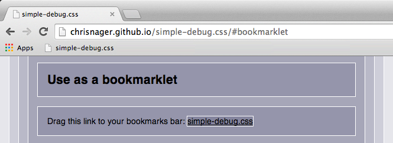
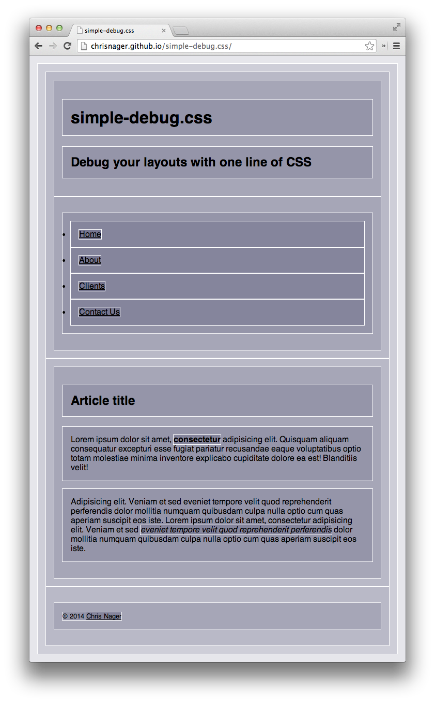

# simple-debug.css

Debug your layouts with one line of CSS


## How to use

There are a few ways you can use simple-debug.css.

- Install the [Google Chrome extension](//chrome.google.com/webstore/detail/simple-debugcss/jlkgkebpphmaiemciejnmgccejccnpha).

- Drag this link to your bookmarks bar
<a href="javascript:(function(){var d,t=document.createElement('style'),h=document.getElementsByTagName('head')[0];t.setAttribute('id','simple-debug-css');t.innerHTML='*{outline:1px solid #fff!important;background-color:rgba(0,2,54,.1)!important}';d=document.getElementById('simple-debug-css');d==null?h.appendChild(t):h.removeChild(d)})()">simple-debug.css</a>


- Install with npm
```shell
npm install simple-debug.css
```

- Install with bower
```shell
bower install simple-debug.css
```

- Include `simple-debug.css` just before the `</head>` closing tag.
```html
    …
    <link rel="stylesheet" href="app.css">
    <link rel="stylesheet" href="simple-debug.css">
</head>
```

- Paste in this single line of code at the bottom of your site's last CSS file.
```css
*{outline:1px solid #fff!important;background-color:rgba(0,2,54,.1)!important}
```



Try it out on [CodePen](//codepen.io/chrisnager/pen/saxeL).


## License

The MIT License (MIT)

Copyright (c) 2014-2015 [Chris Nager](//twitter.com/chrisnager)

Permission is hereby granted, free of charge, to any person obtaining a copy
of this software and associated documentation files (the "Software"), to deal
in the Software without restriction, including without limitation the rights
to use, copy, modify, merge, publish, distribute, sublicense, and/or sell
copies of the Software, and to permit persons to whom the Software is
furnished to do so, subject to the following conditions:

The above copyright notice and this permission notice shall be included in all
copies or substantial portions of the Software.

THE SOFTWARE IS PROVIDED "AS IS", WITHOUT WARRANTY OF ANY KIND, EXPRESS OR
IMPLIED, INCLUDING BUT NOT LIMITED TO THE WARRANTIES OF MERCHANTABILITY,
FITNESS FOR A PARTICULAR PURPOSE AND NONINFRINGEMENT. IN NO EVENT SHALL THE
AUTHORS OR COPYRIGHT HOLDERS BE LIABLE FOR ANY CLAIM, DAMAGES OR OTHER
LIABILITY, WHETHER IN AN ACTION OF CONTRACT, TORT OR OTHERWISE, ARISING FROM,
OUT OF OR IN CONNECTION WITH THE SOFTWARE OR THE USE OR OTHER DEALINGS IN THE
SOFTWARE.
